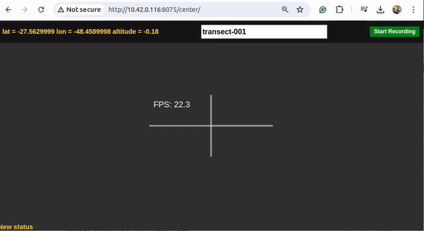
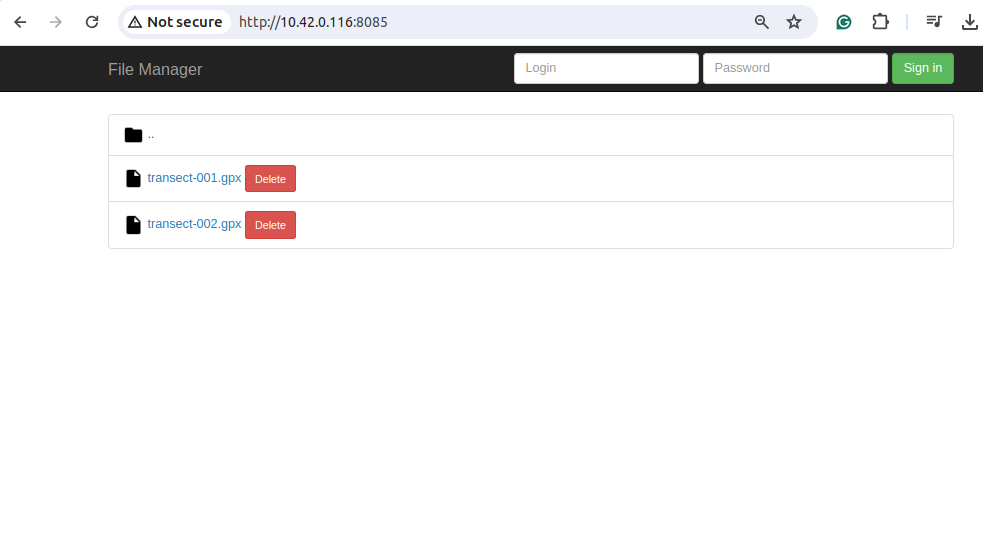

# Pi GPX Camera
*Pi GPX Camera* is a simple Python application designed to stream hardware encoded h.264 from a Raspberry Pi equiped with a HQ camera module, directly to a browser and allow recording of full res mjpeg stream. 


# Viewing
When server.py is running the feed can be vied from any broswer via the following urls. **_rpi_address_** is the ip address or hostname of your Raspberry Pi, and **_serverPort_** is the port you set in the configuration section.  

1. The primary viewing screen  (not currently workimg!!!)
    ```
    http://<rpi_address>:<serverPort>/   
    ```
2. The focus peaking screen 
    ```
    http://<rpi_address>:<serverPort>/focus/
    ```
3. The center reticle screen 
    ```
    http://<rpi_address>:<serverPort>/center/
    ```

# Installation
1. [Ensure the camera module is properly connected to the Raspberry Pi](https://projects.raspberrypi.org/en/projects/getting-started-with-picamera/2) with Bullseye or later based OS.


2. If Needed Disable legacy camera with `sudo raspi-config`

3. Bullseye and above come with Picamera2, if not installed then follow [Picamera2](https://datasheets.raspberrypi.com/camera/picamera2-manual.pdf) documentation

    ``` sh
    sudo apt-get install python3-picamera2
    ```

5. Install the [Pi GPX Camera package](https://github.com/Revive-Our-Gulf/pi-gpx-camera) and create a venv with system-site-packages enabled
    ``` sh
    mkdir repos
    cd repos
    git clone https://github.com/Revive-Our-Gulf/pi-gpx-camera.git
    cd pi-gpx-camera
    python -m venv --system-site-packages 'venv'
    source ./venv/bin/activate
    pip install --upgrade pip
    pip install -e .
    ```

# Mavlink
Setup a MAV endpoint in Blueos as follows 

This allows the gpx info to be collected .

# To Run

Normally this will automatically start on boot as a service, see services below
``` sh
 ~/repos/pi-gpx-camera/venv/bin/gpxcam
```
Then on browser navigate to  [http://10.42.0.116:8075/center/](http://10.42.0.116:8075/center/) 



Start recording will begin a save of the gpx file in `~/repos/pi-gpx-camera/data`

You can set the name the files saved in the input box.

# File Manager

The view, download and delete files navigate to http://10.42.0.116:8085/

> **Note**: The window needs to be manually refreshed to see new files (needs a periodic update /  file watcher)




You may need to start the filemanager (if not running as a service)
``` sh
filemanager
```

# To run as a service

Run this script so the server runs at startup

``` sh
./scripts/setup-service.sh 
```
Show Status of the service 
``` sh
systemctl status runserver.service
systemctl status filemanager.service
```

To stop the service 
``` sh
sudo systemctl stop runserver.service
```

# Optional configuration
open server.py and edit the following section of code as needed. 
- The webserver will run on the port you set **_serverPort_** to.  
- Refer to the Picamera2 documentation for details on how to configure it. A lage number of options exist 


#  if not running on Blue-os rPi
The Blue os might be using legacy camera, check first:

Disable legacy camera with `sudo raspi-config`


